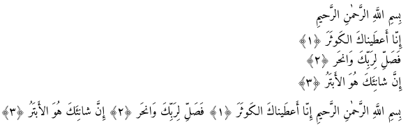

# The quran package
Copyright © 2015-2022

The package is prepared for typesetting the holy Quran.
This work provides several macros for typesetting the whole or
any parts of the holy Quran based on its popular divisions.

### Sample

```
\documentclass{article}

\usepackage{arabxetex}
\usepackage{quran}

\begin{document}

    \begin{arab}[utf]
        \quransurah[108]
        \medskip
        \quransurah*[108]
    \end{arab}

\end{document}
```



